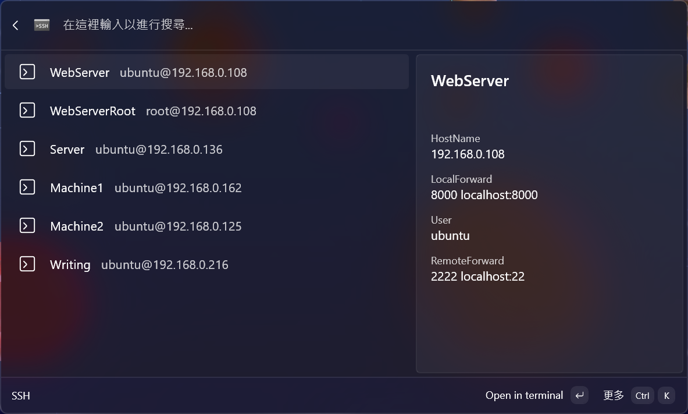

# SSH for CmdPal

Command Pallet extension for connecting to SSH clients that configured at `~/.ssh/config` file.

## Usage

### Open SSH Connection in Terminal

## Install Dev Version

**Prerequisite**

- [winapp cli](https://github.com/microsoft/winappCli): `winget install Microsoft.WinAppCli`

**Steps**

1. Download both `SSH_<version>.msixbundle` and `cert.pfx`
2. `sudo winapp cert install cert.pfx` (only need to do this once)
3. Click to install or `Add-AppxPackage <msix>`

